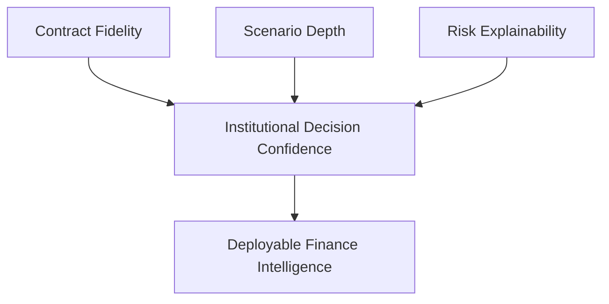

# TPEX Core (Public)

**Structured finance intelligence architecture for contract-aware risk and decision modeling.**

TPEX Core combines software architecture and financial engineering to model complex contract structures, exposure behavior, and scenario-driven decision paths.

## Core Positioning
Traditional analytics tools often flatten structural complexity. TPEX is designed to preserve that structure so underwriting, portfolio strategy, and risk interpretation are grounded in executable logic.

## What TPEX Is Built To Deliver
- Contract intelligence with lifecycle-aware analytics
- Exposure graph modeling across layered structured positions
- Scenario simulation for underwriting and portfolio strategy
- Production-ready decision support, not analysis-only prototypes

## Visual Snapshot (Non-Architectural)

## Public Quality Markers
- Scenario coverage across instrument structures
- Explainability of contract-to-risk propagation paths
- Stability of model outputs under stress-case variation
- Time-to-decision for underwriting and portfolio workflows

## Engineering Approach
TPEX treats financial logic as software: executable, testable, and integration-ready.

## Collaboration
I engage with qualified partners on technical diligence, deployment strategy, and commercialization pathways.

## Public Boundary
This repository is intentionally high-level.

No proprietary model internals, confidential financial logic details, or trade-secret implementation assets are disclosed here.
