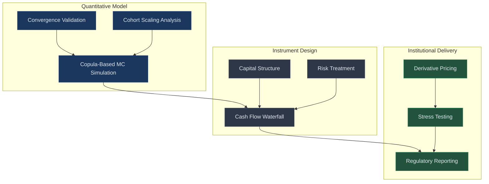

# TPEX Core (Public)

**A new structured finance asset class. Model-first design, software-second.**

TPEX Core is a proprietary structured finance instrument — designed first as a quantitative model, validated in spreadsheet form, then engineered into production software. The financial structure is the invention. The software makes it executable, auditable, and deployable for institutional placement.

---

## What This Is

TPEX addresses a structural gap in private equity allocation. The instrument design, capital structure, and risk mechanics are original work backed by a published academic paper, 15 investment bank due diligence documents, and a full Monte Carlo simulation framework.

The model was built to survive institutional scrutiny — rating agency criteria, regulatory capital treatment, and dealer network infrastructure that has operated for 40+ years.

---

## Quantitative Foundation

- **Dependence modeling** — Student-*t* copula with sector/stage correlation matrices capturing fat-tail dependence and joint extreme events
- **Monte Carlo engine** — Parallelized path generation at 334,000+ paths/sec with convergence-validated IRR solving
- **Waterfall mechanics** — Priority-based cash flow allocation with carried interest above hurdle
- **Derivative pricing** — 5 IB-grade engines with full Greeks and counterparty credit valuation adjustment
- **Capital adequacy** — CCAR/DFAST stress scenarios with Basel III risk-weight treatment
- **Cohort analysis** — Portfolio scaling validation across multiple portfolio sizes with statistical convergence

```mermaid
flowchart TD
    subgraph Quantitative Model
        A[Copula-Based MC Simulation]
        B[Convergence Validation]
        C[Cohort Scaling Analysis]
    end

    subgraph Instrument Design
        D[Cash Flow Waterfall]
        E[Capital Structure]
        F[Risk Treatment]
    end

    subgraph Institutional Delivery
        G[Derivative Pricing]
        H[Stress Testing]
        I[Regulatory Reporting]
    end

    A --> D
    B --> A
    C --> A
    D --> I
    E --> D
    F --> D
    G --> H
    H --> I

    style A fill:#1a365d,stroke:#2a4a7f,color:#e2e8f0
    style B fill:#1a365d,stroke:#2a4a7f,color:#e2e8f0
    style C fill:#1a365d,stroke:#2a4a7f,color:#e2e8f0
    style D fill:#2d3748,stroke:#4a5568,color:#e2e8f0
    style E fill:#2d3748,stroke:#4a5568,color:#e2e8f0
    style F fill:#2d3748,stroke:#4a5568,color:#e2e8f0
    style G fill:#22543d,stroke:#2f855a,color:#e2e8f0
    style H fill:#22543d,stroke:#2f855a,color:#e2e8f0
    style I fill:#22543d,stroke:#2f855a,color:#e2e8f0
```

---

## Validation

| Metric | Value |
|--------|-------|
| Simulation throughput | 334,000+ paths/sec |
| Codebase | 10 crates, 42,000+ lines of Rust |
| Test suite | 393 tests, 0 failures |
| Derivative engines | 5 (with Greeks and CVA) |
| CLI commands | 20 |
| Stress framework | CCAR/DFAST institutional scenarios |
| GAAP standards | ASC 815, 820, 810, 860, 606 |
| Research | Published academic paper + 15 IB due diligence documents |

---

## Engineering

The model was proven first. The software is the production implementation — Rust, LTO-optimized, with optional GPU acceleration and Python bindings for quant desk integration. Designed for institutional deployment, regulatory scrutiny, and investment bank technical diligence.

---

## IP & Licensing

TPEX Core is proprietary intellectual property — the structured product design, quantitative models, academic research, and software. The instrument itself is the primary IP, not just the platform. Available for licensing on a selective basis.

For licensing inquiries, technical diligence, or deployment discussions: [contact via GitHub profile].

## Public Boundary

This repository is intentionally high-level. No proprietary instrument design, capital structure, waterfall logic, correlation structures, or implementation assets are disclosed here.
