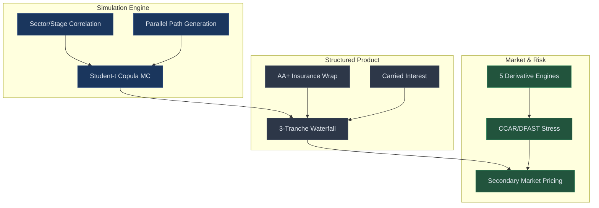

# TPEX Core (Public)

**Synthetic private equity exposure. Tranched, insured, and structured for 144A placement.**

TPEX Core is a proprietary structured finance platform that models a new asset class: synthetic exposure contracts tethered to private equity company performance, tranched into senior/mezzanine/equity classes with an AA+ financial guarantee on the senior tranche. Student-*t* copula Monte Carlo simulation, IB-grade derivative pricing, and regulatory capital treatment — engineered as a single deployable system.

---

## Why This Exists

Private equity returns are inaccessible to most institutional allocators. Existing vehicles force a binary choice: direct LP commitments (illiquid, high minimums, J-curve) or listed PE proxies (correlated with equity markets, defeating the purpose).

No product currently combines:

- **Synthetic exposure** — Performance-linked contracts, not fund LP interests or loans
- **Structural subordination** — Three risk classes with different return/risk profiles from the same portfolio
- **Insurance arbitrage** — AA+ wrap on the senior tranche collapses Basel III risk weight from 1250% to 20%
- **Secondary market infrastructure** — Regime-gated liquidity progression from Reg D through 144A to exchange-traded

TPEX is a new asset class traveling on 40+ years of proven structured credit infrastructure — CUSIP, DTC, TRACE, 144A, rating agency criteria, dealer networks.

---

## Quantitative Foundation

- **Dependence modeling** — Student-*t* copula with sector/stage correlation matrices capturing fat-tail dependence and joint extreme events
- **Monte Carlo engine** — Parallelized path generation at 334,000+ paths/sec with convergence-validated IRR solving
- **Waterfall mechanics** — Priority-based cash flow allocation across three tranches with carried interest above hurdle
- **Derivative pricing** — 5 IB-grade engines with full Greeks and counterparty credit valuation adjustment
- **Capital adequacy** — CCAR/DFAST stress scenarios with Basel III risk-weight treatment per tranche
- **Insurance modeling** — Phased wrap activation with premium optimization and trigger conditions

```mermaid
flowchart TD
    subgraph Simulation Engine
        A[Student-t Copula MC]
        B[Sector/Stage Correlation]
        C[Parallel Path Generation]
    end

    subgraph Structured Product
        D[3-Tranche Waterfall]
        E[AA+ Insurance Wrap]
        F[Carried Interest]
    end

    subgraph Market & Risk
        G[5 Derivative Engines]
        H[CCAR/DFAST Stress]
        I[Secondary Market Pricing]
    end

    A --> D
    B --> A
    C --> A
    D --> I
    E --> D
    F --> D
    G --> H
    H --> I

    style A fill:#1a365d,stroke:#2a4a7f,color:#e2e8f0
    style B fill:#1a365d,stroke:#2a4a7f,color:#e2e8f0
    style C fill:#1a365d,stroke:#2a4a7f,color:#e2e8f0
    style D fill:#2d3748,stroke:#4a5568,color:#e2e8f0
    style E fill:#2d3748,stroke:#4a5568,color:#e2e8f0
    style F fill:#2d3748,stroke:#4a5568,color:#e2e8f0
    style G fill:#22543d,stroke:#2f855a,color:#e2e8f0
    style H fill:#22543d,stroke:#2f855a,color:#e2e8f0
    style I fill:#22543d,stroke:#2f855a,color:#e2e8f0
```

---

## Platform Scope

| Domain | Capability |
|--------|-----------|
| **Structuring** | 3-tranche waterfall, insurance wrap triggers, carried interest, fee pipeline |
| **Simulation** | Student-*t* copula MC, cohort scaling analysis, convergence validation |
| **Derivatives** | 5 instruments — full Greeks, CVA, book-level risk aggregation |
| **Risk** | VaR/CVaR, Basel III capital treatment, CCAR/DFAST, concentration, sensitivity |
| **Reporting** | GAAP (ASC 815/820/810/860/606), bank pitch, trustee report, K-1/UBTI tax |
| **Market Data** | SEC EDGAR universe construction, BDC/CLO benchmarks, FX rates |
| **Delivery** | 20 CLI commands, REST API, WebSocket, Python bindings |

---

## Validation

| Metric | Value |
|--------|-------|
| Simulation throughput | 334,000+ paths/sec |
| Codebase | 10 crates, 42,000+ lines of Rust |
| Test suite | 393 tests, 0 failures |
| Derivative engines | 5 (with Greeks and CVA) |
| CLI commands | 20 |
| Stress framework | CCAR/DFAST institutional scenarios |
| GAAP standards | ASC 815, 820, 810, 860, 606 |
| Research | Published academic paper + 15 IB due diligence documents |

---

## Engineering

Production Rust with optional GPU acceleration. Structured finance logic treated as software — executable, testable, auditable. LTO-optimized release builds. Python bindings for quant desk integration. Not a spreadsheet. Not a prototype. Designed for institutional deployment, regulatory scrutiny, and investment bank technical diligence.

---

## IP & Licensing

TPEX Core is proprietary intellectual property, including the underlying structured product design, quantitative models, academic research, and software. Available for licensing on a selective basis.

For licensing inquiries, technical diligence, or deployment discussions: [contact via GitHub profile].

## Public Boundary

This repository is intentionally high-level. No proprietary model internals, waterfall logic, correlation structures, derivative pricing methodology, or implementation assets are disclosed here.
